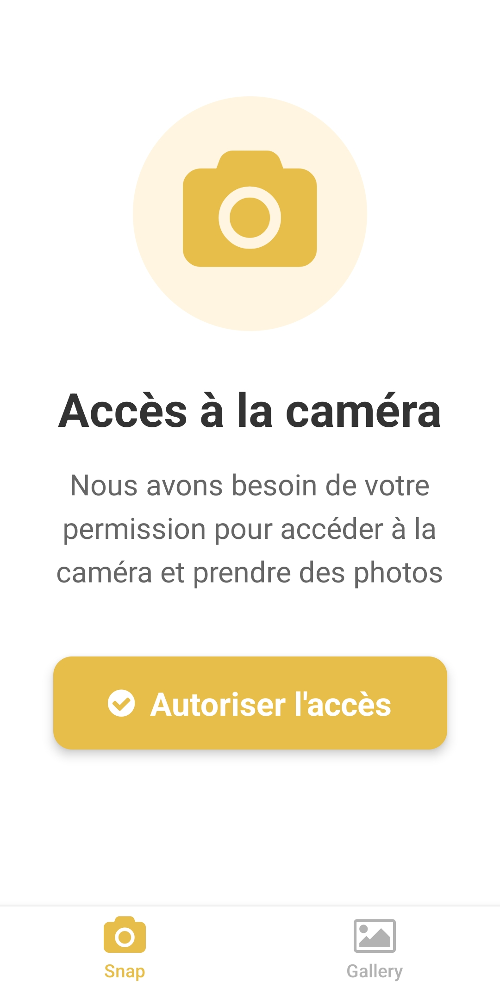

# 📸 SnapPic

Application mobile de photographie développée avec React Native et Expo. SnapPic permet de prendre des photos, de les stocker dans une galerie et de les gérer facilement.

## 🎯 Objectif du projet

Projet réalisé dans le cadre de ma formation **Développeur Web et Web Mobile (DWWM)** pour apprendre React Native et la gestion d'état avec Redux.

## ✨ Fonctionnalités

### Authentification
- ✅ Écran d'accueil avec validation d'email (regex)
- ✅ Design moderne avec dégradé de couleurs
- ✅ Enregistrement de l'email dans Redux
- ✅ Navigation fluide vers la galerie

### Caméra
- ✅ Caméra fonctionnelle (avant/arrière)
- ✅ Prise de photos en temps réel
- ✅ Aperçu avant sauvegarde
- ✅ Interface utilisateur intuitive
- ✅ Gestion des permissions caméra

### Galerie
- ✅ Affichage des photos en grille (2 colonnes)
- ✅ Photos par défaut + photos prises
- ✅ Compteur de photos
- ✅ Badge "Par défaut" sur les photos initiales
- ✅ Suppression des photos personnelles
- ✅ Design moderne avec ombres et effets

### Navigation
- ✅ Bottom Tab Navigator (Snap / Gallery)
- ✅ Icônes FontAwesome personnalisées
- ✅ Couleurs thématiques (#e8be4b / #b2b2b2)

## 🛠️ Technologies utilisées

- **React Native** - Framework mobile
- **Expo** - Plateforme de développement
- **Redux Toolkit** - Gestion d'état
- **React Navigation** - Navigation
- **Expo Camera** - Accès à la caméra
- **Expo Linear Gradient** - Dégradés
- **FontAwesome** - Icônes

## 📁 Structure du projet
```
snap-pic/
├── App.js                      # Point d'entrée, configuration navigation et Redux
├── reducers/
│   ├── user.js                # Reducer pour l'utilisateur (email)
│   └── photos.js              # Reducer pour les photos
├── screens/
│   ├── HomeScreen.js          # Écran d'accueil avec validation email
│   ├── GalleryScreen.js       # Galerie de photos
│   └── SnapScreen.js          # Caméra et prise de photos
├── package.json
└── .gitignore
```

## 🚀 Installation

### Prérequis
- Node.js (v14 ou supérieur)
- npm ou yarn
- Application **Expo Go** sur smartphone (Android ou iOS)

### Étapes d'installation

1. **Cloner le repository** :
```bash
   git https://github.com/Libanama/snapp-pic.git
   cd snap-pic
```

2. **Installer les dépendances** :
```bash
   npm install
```

3. **Lancer l'application** :
```bash
   npx expo start
```

4. **Scanner le QR code** avec l'application Expo Go sur votre smartphone

### Dépendances principales
```bash
npm install @react-navigation/native @react-navigation/bottom-tabs @react-navigation/native-stack
npx expo install react-native-screens react-native-safe-area-context
npm install @reduxjs/toolkit react-redux
npx expo install expo-camera
npx expo install expo-linear-gradient
```

## 🎨 Design et interface

### Palette de couleurs
- **Jaune principal** : `#e8be4b` (boutons, éléments actifs)
- **Gris secondaire** : `#b2b2b2` (éléments inactifs)
- **Dégradé HomeScreen** : `#ffd89b` → `#19547b`
- **Fond clair** : `#f5f5f5`

### Caractéristiques visuelles
- Interface moderne et épurée
- Ombres portées et effets de profondeur
- Animations au toucher (activeOpacity)
- Design responsive
- SafeAreaView pour tous les écrans

## 📱 Captures d'écran

<p align="center">
   
 </p>  

## 🔐 Permissions

L'application demande les permissions suivantes :
- **Caméra** : Pour prendre des photos

## 🐛 Résolution de problèmes

### L'app ne charge pas
```bash
npx expo start --clear
```

### Problème de réseau
- Vérifiez que votre PC et smartphone sont sur le même WiFi
- Ou utilisez le mode tunnel :
```bash
npx expo start --tunnel
```

### Erreur de dépendances
```bash
rm -rf node_modules
npm install
```

## 📝 Fonctionnalités futures (Part 2)

- [ ] Filtres photo (N&B, Sépia, Vintage...)
- [ ] Partage de photos
- [ ] Galerie avec zoom
- [ ] Export des photos
- [ ] Mode sombre

## 👨‍💻 Auteur

**Libana**  
Étudiante en formation DWWM (Développeur Web et Web Mobile)  
Septembre 2025 - Avril 2026

## 📄 Licence

Ce projet est réalisé dans un cadre pédagogique.

## 🙏 Remerciements

Projet réalisé dans le cadre de ma formation de développeur web avec l'aide de ressources en ligne et de la communauté React Native.

---

⭐ **N'hésitez pas à mettre une étoile si vous aimez le projet !**

---\n📅 Dernière mise à jour : 11/02/2026